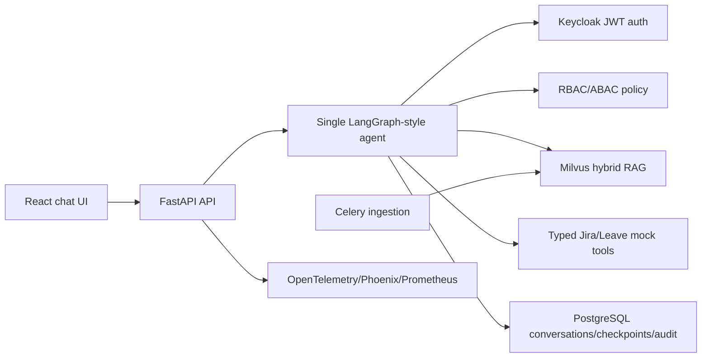

# Architecture

The system is a single agent with explicit graph nodes and framework-independent business rules. FastAPI only handles HTTP concerns. Tool clients, retrieval, authorization, persistence, rate limiting, and LLM behavior are injected through ports.

